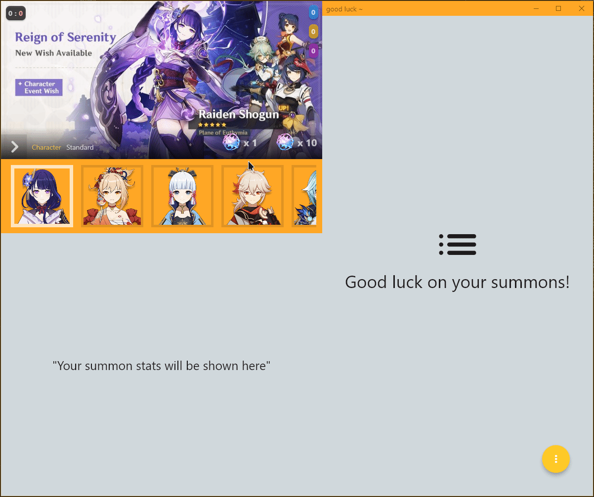
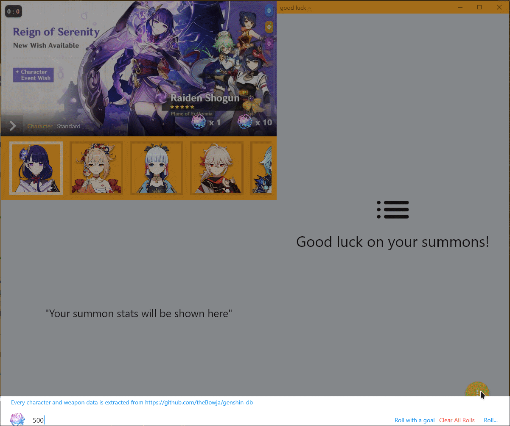

# genshin_summonator

A Summon Simulator for [Genshin Impact](https://genshin.mihoyo.com/) with many features to test your luck.

## Disclaimer

This project was made for fun and testing purposes with zero monetary gain.

This is a project I made for fun because I enjoy coding and wanted to know if I really was unlucky on my pulls.
All assets in this application were taken from 3rd party websites. I do not own any asset from the project.

If you are from Mihoyo and wish to take this project down let me know and I will do so, just don't get me in trouble :0

## Download (Windows Only)

- [Latest releases](https://github.com/fenchai23/genshin_summonator/releases)
  ` Simply download the latest compiled release and open the .exe file.`

## Features

- Allows custom amount of summon, not just x1 and x10 but x500 or x10000 summons. `(careful of this, make sure your system can handle it)`
- Allows roll goals. You can automatically summon until `3` 5\* are summoned in a single 10 pull. `(Please be realistic, the most I have gotten was 3 in a single 10 pull lol)`

## Preview
- Summon System

- Custom Qty Summons

Auto-Summons with a Goal

## Roadmap

- [ ] Allow custom summon rates (5\* can be increased to 6.0 instead of 0.6, etc)
- [ ] Goal Roll (stop summoning until you get a weapon(s) or character(s) of your choice)
- [ ] SplashPage video
- [ ] Summoning videos
- [ ] Auto update and fetch banner data

## Development

- Flutter
- Dart
